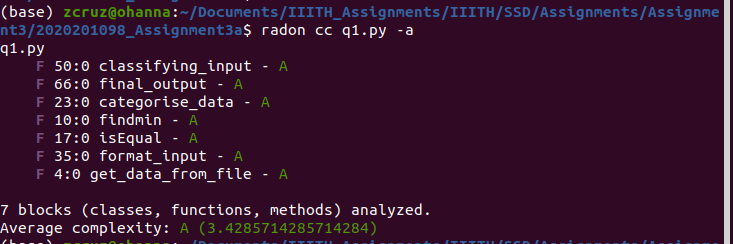
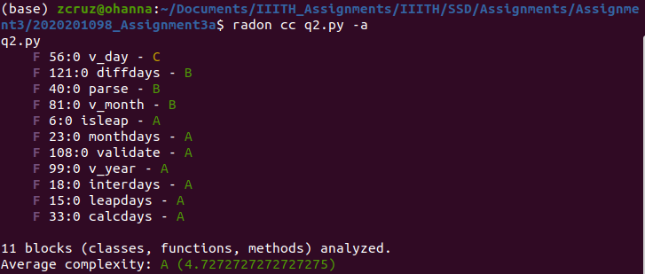
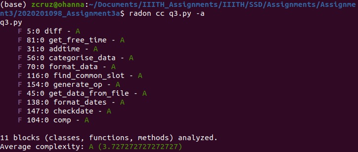

# Assignment 3 part C

# Q1
* I have now distributed the whole code into functions to actually check the cyclometric complexity.
* There were already 2 functions `findmin` and `isEqual`
* Rest of the code were written directly.
* I have just copy pasted the codes at regular breaks into suitable functions.
* Total 7 functions are there now.
1. `get_data_from_file` function is used for fetching the data from file into a data strucure
2. `findmin` function is used for finding the which of the two employees have min level value
3. `isEqual` function checks whether all the elements in a list are equal or not
4. `categorise_data` function splits the data recieved from the file into suitable variables for further ease of use
5. `format_input` function formats the input recieved into a suitable format i.e list of integers
6. `classifying_input` function does the preprocess of the formatted input, so that we can do our operation on that.
7. `final_output` function does the main work of producing the result.
* 

# Q2
* I have not modified anything in it as everything was modularised already.
* There are 11 total functions
1. `parse` function splits the input into day,month and year (The order is not neccessary)
2. `diffdays` function is the major function which does prelimary check of validating date, it then passes the dates to `validate`   function for deep level check and after the result computes the difference and return the output.
3. `validate` function is the main primary function for validating dates. It has subfunctions for validating each segment of date.
4. `v_year` function validates the year
5. `v_month` function validates the month
6. `v_day` function validates the day
7. `calcdays` function calculates the total days from beginning of the calendar to that date.
8. `interdays` function is a subfunction called to calculate total days till penultimate year.
9. `monthdays` function is a subfunction called to calculate total days from the beginning of a year till the penunltimate month.
10. `isleap` function is used to find whether a year is leap or not.
11. `leapdays` function is used to calculate total leap days from the beginning of calendar to the given year.
* 

# Q3
* I have distributed the whole code into functions.
* There were previously 4 functions.
* I have added a try-catch block in line 131 to deal with Index Error
* There are 11 total functions now.
1. `comp` function is a comparator function to compare time in a list to sort it
2. `get_data_from_file` function is used to fetch data from the file to the data strucure.
3. `categorise_data` function is used for further categorising that data into parts for the ease.
4. `format_data` function is used to format the data into suitable form for our need.
5. `checkdate` function is used to check whether all dates of the employees are same or not.
6. `format_dates` function is used to convert string dates to date object.
7. `diff` function returns difference in minutes between two time
8. `addtime` function is used to add minutes to a time string and return the resulting string
9. `get_free_time` function is used to extract the free time slots of every Employee and add it the list
10. `find_common_slot` function is used to find the first common suitable free time slot among all Employees.
11. `generate_op` function generates a string with suitable output to print to the ouput file.
* 

## Github link:
[GitHub](https://github.com/ramirocruz/2020201098_Assignment3a)
